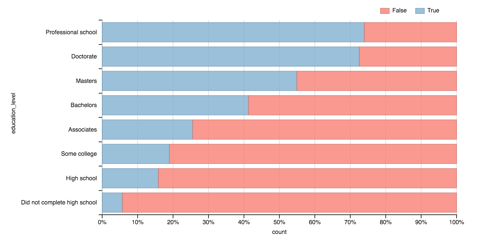

## RTI CDS Frontend Developer Exercise

Welcome to the RTI Center for Data Science front-end developer exercise! This exercise is here to get you acquainted with a small sample of what we do and for us to get acquainted with your skills. It should take no more than two hours of your time.

This exercise provides a CSV file with some data derived from the 1996 US Census. You will have to use that data to present several charts.

----

### Some guidance

1. Fork this repository to your personal GitHub account and clone the fork to your computer.
2. Save and commit your answers to your fork of the repository, and push them back to your personal GitHub account.
3. Use the Internet as a resource to help you complete your work. We do it all the time.
4. Comment your code so that when you look back at it in a year, you'll remember what you were doing.
5. Use the tools you are comfortable with.
6. Have fun and don't overthink it!

----

### The Task

1. Read the section below about **the data**.
2. Make a visualization that shows the percentage of people who make above and below $50K for each education group. An example of how this could look:

  

3. Make the same visualization for race instead of education group.
4. As a bonus, if you have time, combine the two on one chart.
5. When done, commit your work to your clone of this repository. Add any instructions we need to build your work. Email us a link to your clone.

----

### The Data

This repository contains a file called `census.csv`. 

It contains a dataset that has 48842 US Census records with the following fields:

- `age`: a continuous variable representing an individual's age
- `education_level`: the highest level of education an individual received
- `race`: an individual's race
- `sex`: an individual's sex
- `over_50k`: a boolean variable representing whether the individual makes over $50,000/year. A value of 1 means that the person makes greater than $50,000/year and a value of 0 means that the person makes less than or equal to $50,000/year.
- `over_50k_text`: Same as `over_50k`, but using "True" and "False".
- `count`: the number 1. This may be useful in calculations.